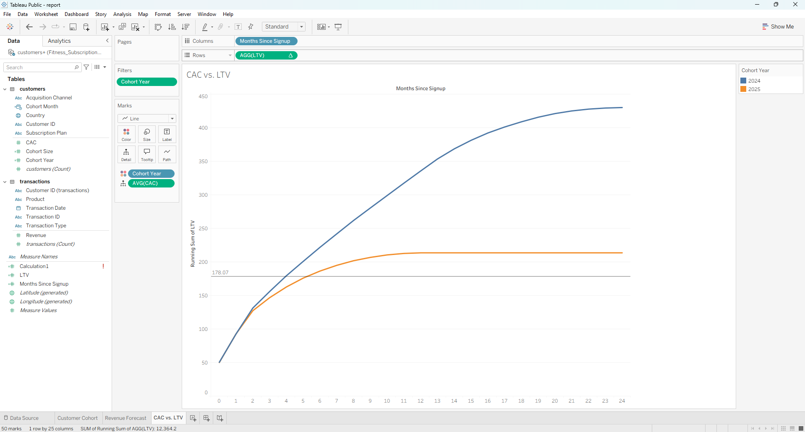
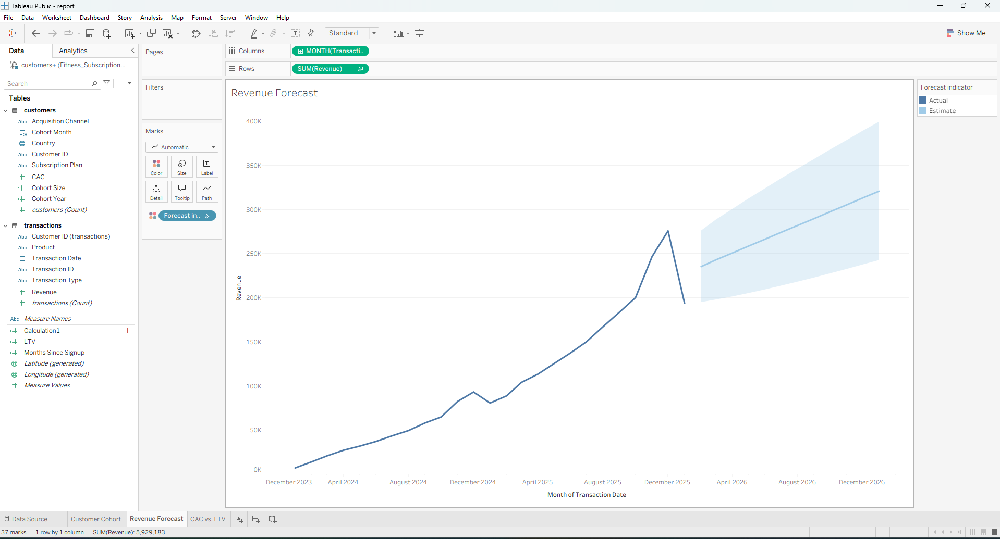

# Fitness Subscription Analytics

## Executive Summary
This project analyzes customer cohort behavior, lifetime value (LTV), customer acquisition costs (CAC), and revenue forecasting for a subscription-based fitness platform using Tableau.

## Project Deliverables
- **Data Source:** `data/Fitness_Subscriptions_Dataset.xlsx`
- **Tableau Analysis Workbook:** Included in repository root.

## Key Insights & Visualizations

### 1. CAC vs. LTV Analysis

- **Payback Period:** Customer acquisition costs ($178.07) are fully recovered around Month 4–5 across cohorts.
- **LTV Progression:** Long-term cohort performance reaches an LTV ratio above 2.4x CAC over 24 months.

### 2. Customer Cohort Analysis

- Evaluates retention dynamics and revenue trends across signup cohorts.

### 3. Revenue Forecast

- Models future monthly recurring revenue based on historical churn and subscription performance.

### 4. Data Model

- Relationships and data transformations connecting customer accounts and transaction histories.
